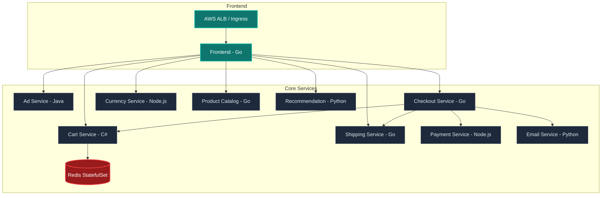

# Cloud-Native Microservices E-Commerce: Production-Grade DevOps Portfolio

A production-grade, highly secure, and observable deployment of the Google Cloud microservices demo on AWS EKS. This project has been engineered to showcase enterprise DevOps best practices, featuring a complete GitOps pipeline, advanced Kubernetes hardening, infrastructure as code (IaC), supply chain security, and a full OpenTelemetry observability stack.

---

## 🏗️ Architecture Overview

The application is an online boutique consisting of 10 microservices communicating via gRPC/HTTP:



---

## 🛠️ Tech Stack & Key Features

*   **Infrastructure as Code (IaC):** Modular Terraform 1.5+ utilizing AWS EKS Module v20 (with Access Entry API enabled) and secure S3/DynamoDB state locking.
*   **GitOps:** ArgoCD utilizing the **App-of-Apps** pattern. Microservices are consolidated into a single application definition overlaying a registry-agnostic base.
*   **CI/CD Pipelines:** GitHub Actions featuring:
    *   Change detection (only builds modified services)
    *   Hadolint (Dockerfile linting) & Trivy (Container security scans)
    *   SHA-based image promotion to AWS ECR
    *   Automated GitOps tag updates via automated commits
*   **Kubernetes Hardening:**
    *   Dedicated, least-privilege IAM Roles for Service Accounts (IRSA)
    *   Horizontal Pod Autoscalers (HPA) & Pod Disruption Budgets (PDB)
    *   StatefulSet deployment for Redis cache with stable networking
    *   Calico network policies for pod-level isolation
    *   Pod Topology Spread Constraints for high availability (HA)
*   **Observability:** Full OpenTelemetry integration tracing requests via Grafana Tempo, logs via Grafana Loki, and metrics via Prometheus/Grafana.

---

## 📂 Repository Structure

```text
.
├── .github/workflows/       # GitHub Actions CI/CD workflows
├── docker-compose.yml       # Local orchestration for dev/testing
├── terraform/               # Modular Infrastructure as Code
│   ├── main.tf              # VPC, EKS, and core providers
│   ├── eks.tf               # EKS Cluster config (v20 module)
│   ├── variables.tf         # Parameterized environment inputs
│   └── backend.tf           # S3 remote state lock
└── k8s/                     # GitOps manifests
    ├── base/                # Registry-agnostic microservice definitions
    ├── overlays/
    │   └── prod/            # Production environment (ECR registries, HPAs, PDBs)
    └── apps/                # ArgoCD App-of-Apps definitions
```

---

## 🚀 Getting Started

### Prerequisites

*   AWS CLI & Account configured with Admin access
*   Terraform `>= 1.5.0`
*   `kubectl` & `helm`

### 1. Provision Infrastructure

1. Navigate to the `terraform` directory:
   ```bash
   cd terraform
   ```
2. Initialize Terraform (local backend is used first to bootstrap S3/DynamoDB):
   ```bash
   terraform init
   ```
3. Apply the bootstrap configuration to create the state resources:
   ```bash
   terraform apply -target=aws_s3_bucket.terraform_state -target=aws_dynamodb_table.terraform_locks
   ```
4. Migrate the state to S3 (uncomment the `backend` block in `backend.tf`):
   ```bash
   terraform init -migrate-state
   ```
5. Apply the rest of the infrastructure:
   ```bash
   terraform apply
   ```

### 2. Configure GitOps (ArgoCD)

The cluster uses the App-of-Apps pattern. Deploy the parent application to bootstrap all microservices:
```bash
kubectl apply -f k8s/parent-argocd.yaml
```

---

## 🔒 Security Standards

1.  **Zero-Trust Network Policies:** All services default to `deny-all` and must explicitly whitelist incoming gRPC/HTTP traffic.
2.  **No Leaked State/Secrets:** AWS Account IDs are completely parameterized. EKS Node IAM Roles handle ECR image pulls natively, eliminating fragile 12-hour registry credentials.
3.  **Vulnerability Gates:** Hadolint scans Dockerfiles and Trivy scans build images. If any `CRITICAL` vulnerability is detected, the CI workflow immediately blocks the release.
