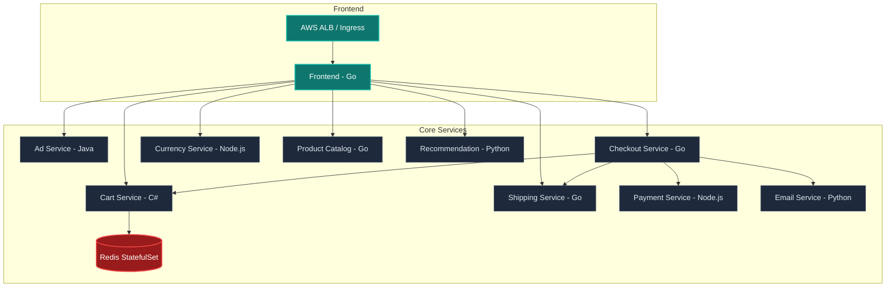

# 🛒 Cloud-Native EKS Microservices Platform

[](https://www.terraform.io/)
[](https://kubernetes.io/)
[](https://aws.amazon.com/eks/)
[](https://argoproj.github.io/cd/)
[](https://github.com/features/actions)
[](https://github.com/aquasecurity/trivy)

A production-grade, highly secure, and observable deployment of the 10-service Google Cloud microservices demo on **Amazon EKS**. Engineered to showcase enterprise DevOps best practices, this platform integrates automated **GitOps pipelines**, comprehensive **Kubernetes hardening**, **Infrastructure as Code (IaC)**, and **full-stack observability**.

---

## 🏗️ Architecture Overview

The system is a polyglot e-commerce application consisting of 10 microservices communicating via gRPC/HTTP:



---

## 🛠️ Features & Enterprise Best Practices

### 1. Infrastructure as Code (IaC)
- **Modular Terraform:** Provisioned a custom VPC, EKS cluster (v20+ module), security groups, subnets, and IAM roles.
- **State Security:** Integrated S3 Remote State storage with DynamoDB state locking and AES-256 encryption.
- **Access Entry API:** Leveraged the modern AWS EKS Access Entry API for programmatic IAM authentication.

### 2. GitOps & CI/CD Pipelines
- **ArgoCD App-of-Apps:** Consolidated deployments using a parent application root, enabling multi-service management with automated drift detection and self-healing.
- **Smart Path Filtering:** GitHub Actions only builds and tests services that have changes inside their respective `src/` directory.
- **GitOps Tag Promotion:** On successful merges, the CI pipeline automatically updates the production overlay with the commit SHA and pushes the tag update back to git.

### 3. Kubernetes Hardening (Zero-Trust)
- **Pod-Level Isolation:** Deployed **13 isolated NetworkPolicies** implementing a default-deny ingress/egress posture.
- **Least-Privilege RBAC:** Assigned dedicated Kubernetes ServiceAccounts to every service.
- **High Availability (HA):** Configured Pod Topology Spread Constraints across Availability Zones (AZs).
- **Graceful Scaling:** Added Horizontal Pod Autoscalers (HPA) and Pod Disruption Budgets (PDB) to safeguard application availability.
- **Stateful Persistence:** Converted Redis cache into a StatefulSet with stable network identity backed by a custom AWS EBS `gp3` StorageClass.

### 4. Supply Chain Security & Gating
- **Container Linting:** Integrated Hadolint into the pull request pipelines to enforce Dockerfile best practices.
- **Vulnerability Gating:** Trivy scans container images for vulnerabilities, failing the CI build on `CRITICAL` findings.
- **SBOM Generation:** Syft creates Software Bill of Materials (SBOM) for auditability.

### 5. Full-Stack Observability
- **Distributed Tracing:** OpenTelemetry Collector deployment configured to capture, process, and export traces and metrics.
- **Prometheus & Grafana:** Pre-packaged monitoring stack with custom dashboards monitoring:
  * Golden Signals (Latency, Traffic, Errors, Saturation)
  * OTEL Pipeline Health
  * Microservice Service Details

---

## 📂 Repository Structure

```text
.
├── .github/workflows/       # GitHub Actions CI/CD workflows
├── docker-compose.yml       # Local orchestration for dev/testing
├── terraform/               # Modular Infrastructure as Code
│   ├── main.tf              # VPC, EKS, and core providers
│   ├── eks.tf               # EKS Cluster config (v20 module)
│   ├── variables.tf         # Parameterized environment inputs
│   └── backend.tf           # S3 remote state lock
└── k8s/                     # GitOps manifests
    ├── base/                # Registry-agnostic microservice definitions
    ├── overlays/
    │   └── prod/            # Production environment (ECR registries, HPAs, PDBs)
    └── apps/                # ArgoCD App-of-Apps definitions
```

---

## 🚀 Deployment Guide

### Prerequisites
* AWS Account & AWS CLI configured
* Terraform `>= 1.5.0`
* `kubectl` & `helm`

### 1. One-Click Deployment
To bootstrap the entire infrastructure (VPC, EKS, ECR registries, EBS CSI drivers), apply Kubernetes manifests, configure ArgoCD, and deploy the monitoring stack, run:
```bash
bash deploy.sh
```

### 2. Accessing the Platform

| Service | Access Method | Credentials |
| :--- | :--- | :--- |
| **Frontend Application** | Open Ingress URL printed in console (Port 80) | None |
| **ArgoCD Dashboard** | Run port-forward: `kubectl port-forward svc/argocd-server -n argocd 8080:443` | User: `admin`<br>Password: Run `kubectl -n argocd get secret argocd-initial-admin-secret -o jsonpath="{.data.password}" \| base64 -d` |
| **Grafana** | Run port-forward: `kubectl port-forward svc/prometheus-grafana -n monitoring 3000:80` | User: `admin`<br>Password: `admin123` |
| **Prometheus** | Run port-forward: `kubectl port-forward svc/kube-prometheus-stack-prometheus -n monitoring 9090:9090` | None |

---

## 🛠️ Operational Runbook & Troubleshooting

### EKS Access Issues ("Unauthorized")
If `kubectl` returns `Unauthorized` when running commands on a newly spun-up cluster, EKS is missing an Access Entry for your active AWS CLI profile. Add your profile's IAM User/Role to EKS:
```bash
aws eks create-access-entry --cluster-name microservices-cluster --principal-arn <YOUR_IAM_PRINCIPAL_ARN>
aws eks associate-access-policy --cluster-name microservices-cluster --principal-arn <YOUR_IAM_PRINCIPAL_ARN> --policy-arn arn:aws:eks::aws:cluster-access-policy/AmazonEKSClusterAdminPolicy --access-scope type=cluster
```

### Cleanup
To destroy all provisioned infrastructure and release AWS resources safely, run:
```bash
bash destroy.sh
```
